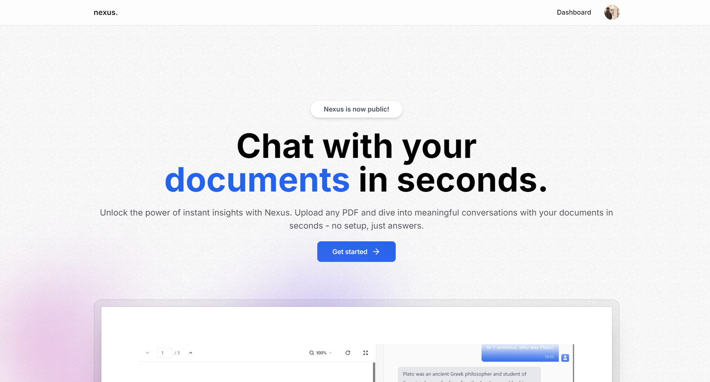

# Nexus-AI
Nexus is an AI-powered tool that quickly finds and retrieves insights from your documents. Using advanced vector search and RAG, it intelligently locates relevant information, making document navigation fast and effortless.

### Tools and Technologies Used

- 🛠️ **Complete SaaS Built From Scratch**: Nexus is a full-fledged SaaS platform.
- 💻 **Beautiful Landing Page & Pricing Page**: Stunning landing page with integrated pricing plans.
- 🔒 **Authentication Using Kinde**: Secure login and user management via Kinde.
- 💳 **Free & Pro Plan Using Stripe**: Supports different subscription tiers using Stripe.
- ⚡ **Infinite Message Loading for Performance**: Optimized loading for smooth and fast messaging.
- 📄 **Beautiful PDF Viewer**: A sleek, functional PDF viewer to navigate your documents.
- 🔄 **Streaming API Responses in Real-Time**: Get real-time responses from AI queries.
- 🎨 **Clean, Modern UI Using 'shadcn-ui'**: Built with a focus on clean and user-friendly design.
- 🚀 **Optimistic UI Updates**: Fast, seamless updates for better user experience.
- 📤 **Intuitive Drag and Drop Uploads**: Easily upload documents with drag and drop.
- ✨ **Instant Loading States**: Zero waiting time with instant feedback during uploads or searches.
- 🔧 **Modern Data Fetching Using tRPC & Zod**: Efficient and reliable data fetching with tRPC and Zod.
- 🧠 **LangChain for Infinite AI Memory**: Advanced AI memory powered by LangChain.
- 🌲 **Pinecone as our Vector Storage**: Robust and scalable vector search using Pinecone.
- 📊 **Prisma as our ORM**: Reliable database management using Prisma ORM.
- 🔤 **100% written in TypeScript**: Entirely developed in TypeScript for type safety and maintainability.

**Stripe Functionality** - Coming soon! Currently in development.
